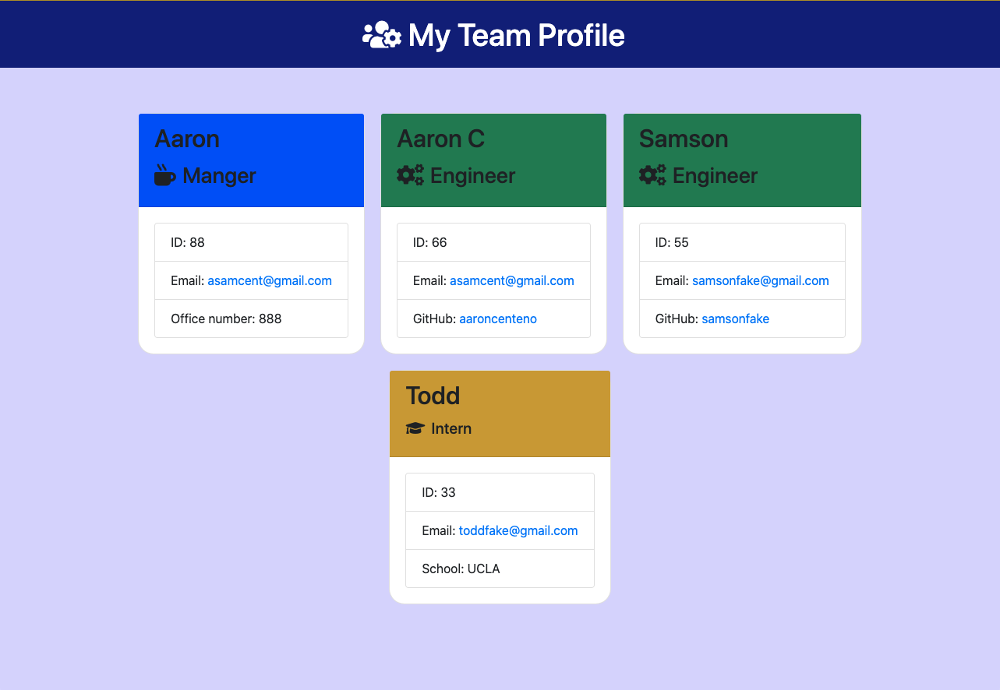
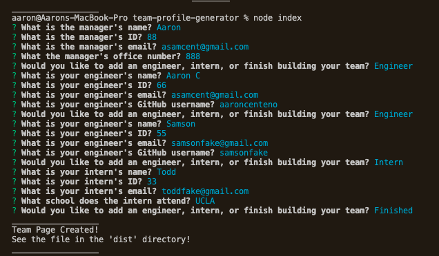

# Team-Profile-Generator

## Description

The project for the week was to create a backend application that would run in the command line. The application accepts user input for an employee such as a Manager, Engineer and Intern. Depending on the role of the employee there will be specific questions for the user to answer, such as 'GitHub' for engineer and 'School' for Intern. After the user answers all of the prompted questions the HTML and CSS page are then created in the 'dist' directory.

## Table of Contents

* [Installation](#installation)
* [Usage](#usage)
* [License](#license)
* [Contributing](#contributing)
* [Tests](#tests)
* [Questions](#questions)

## Installation 

Run 'npm i' in the command line to install all the necessary dependencies.

## Usage

Download the application and run the installation process. In the command line run 'node index' and answer all the provided prompts. Once all the prompts have been answered the HTML and CSS page will be rendered in the 'dist' directory!

## Licenses

* MIT

## Contributing

* Aaron Centeno

## Technologies Used
* Screencastify
* GitHub
* JavaScript
* Terminal

## Test

Tests can be found in the '__tests__' directory of the application. To run a test simply type 'npm run test' in the command line.

## Tutorial Video

## Screenshots

## Questions

Contact Information for questions: 

GitHub: [aaroncenteno](https://www.github.com/aaroncenteno) 

E-mail: asamcent@gmail.com